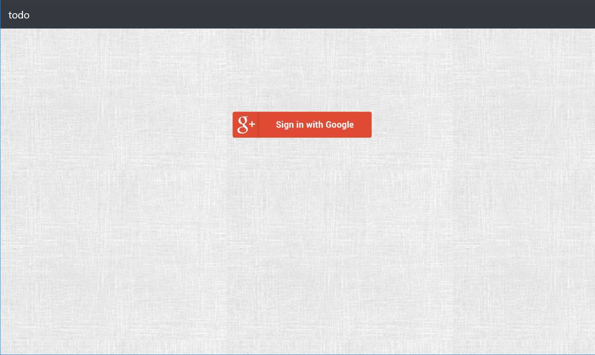
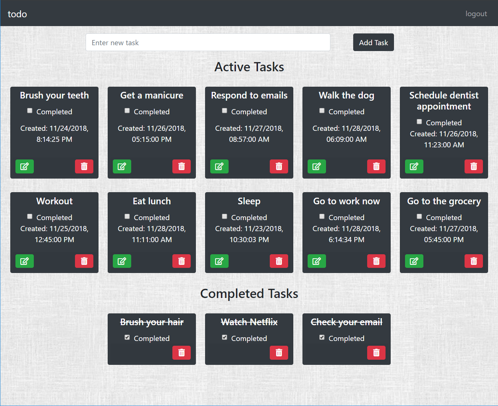
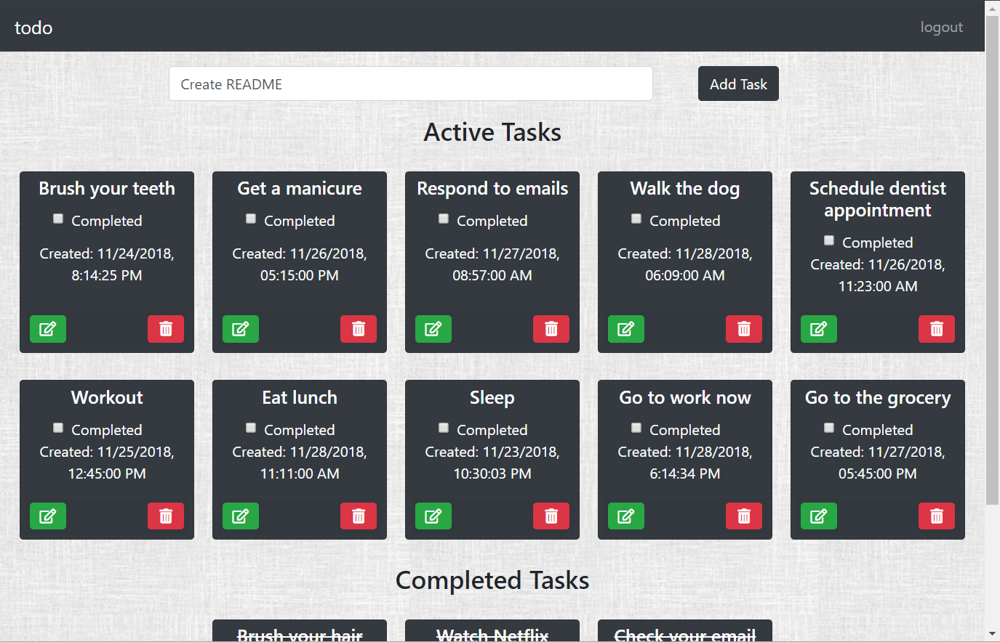
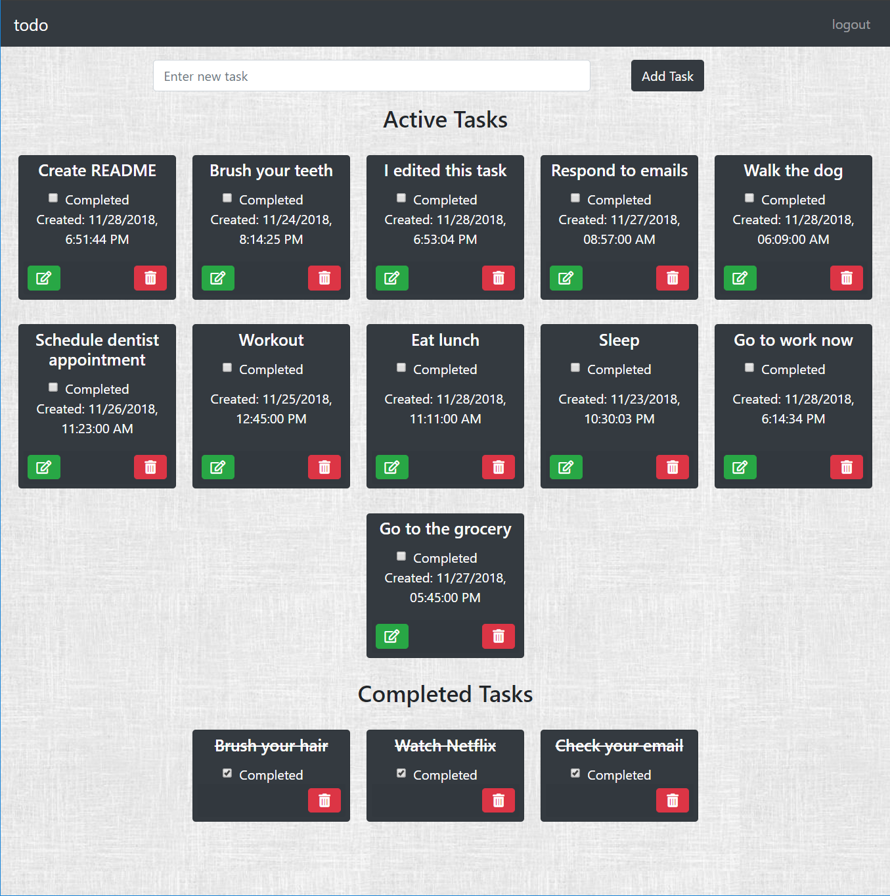
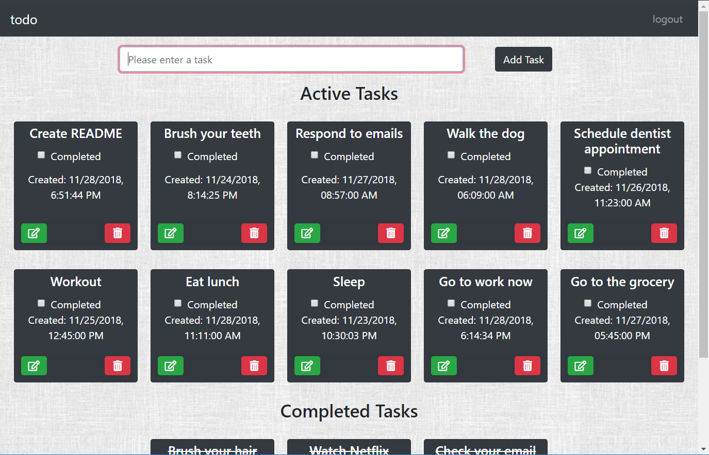
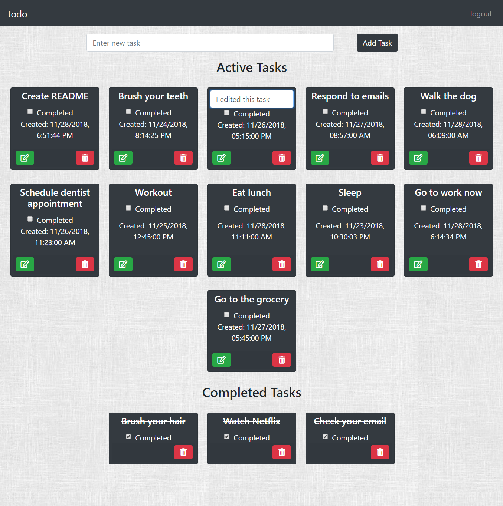
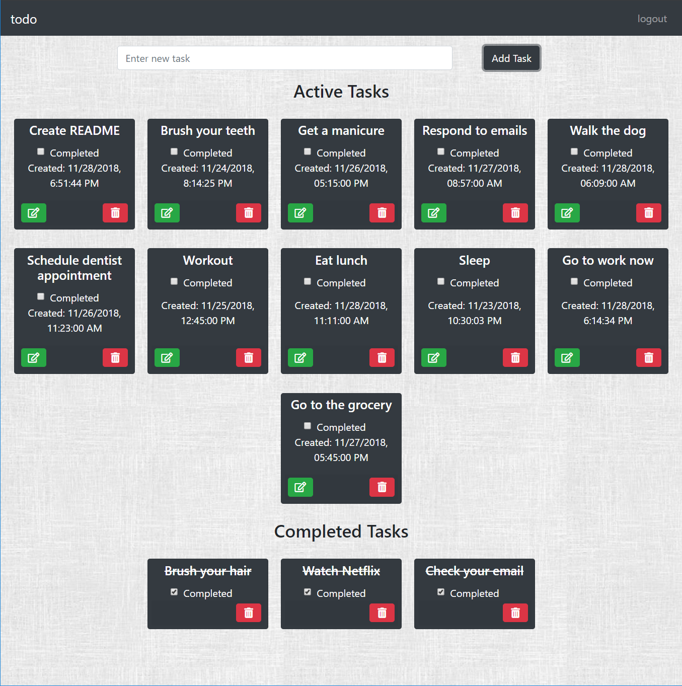
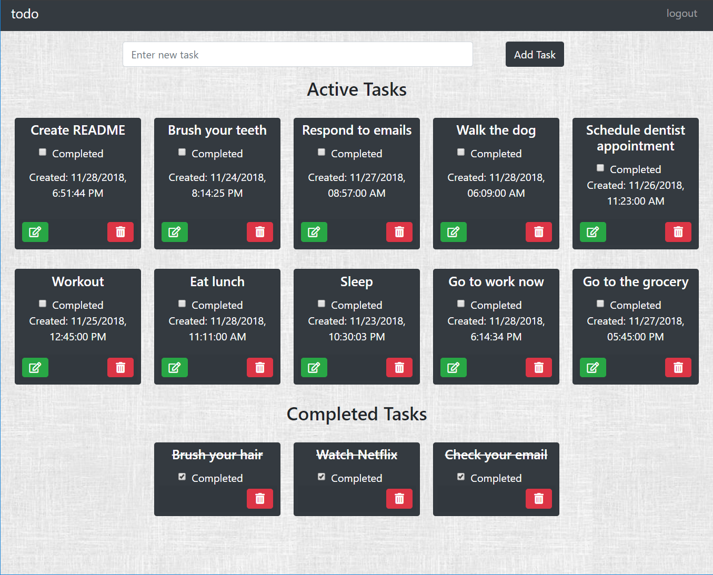

# Firebase Todo

### Description
The purpose of this assignment was to utilize CRUD and firebase to create a to do application.

### Requirements
- Implement Firebase Authentication using Google Auth.
- Make a call to firebase to print your tasks to the page (read).
- At the top of the page,there should be an input field that allows you to add a new task. When you hit enter, then the task should be created in firebase and should be listed with your open tasks on the page.
- Each task should have a checkbox to mark it completed. When a checkbox is marked for a task, then it is moved to a completed list that is below your tasks list. The tasks in your completed list are crossed out.
- Next to both your open tasks and your completed tasks should be a button with a trash symbol. Clicking on the delete button will remove the task from your page and delete the task from firebase.
- Next to only your open tasks, you should have a button with an edit (pencil) symbol. Clicking on the edit button will allow you to edit the entry. On enter, the entry should be edited in firebase and should show up edited within your open tasks list.
- Make the edit inline for the task. Meaning, when you click on the edit symbol, then the area with the task becomes an text input with the task text populated, and focus is automatically on the text field.
- Add timestamps for when tasks are created, and for when tasks are completed.

 ### Technologies Used
* HTML
* JavaScript
* Bootstrap
* jQuery
* Axios
* Sass
* Firebase
* CRUD
* Webpack

### Screenshots
Login View

After you login to application:
* logout appears on navbar
* add task form appears
* active tasks appear
* completed tasks appear

Add a new task:
* enter task in text input
* click add task button or enter
* task is added to active tasks 
* task is added to firebase
* input field is cleared
Empty task error:
* click enter or add task button with empty text input
* text input has red border
* placeholder text is updated
* task is not added to Active Tasks
* border and placeholder text return to default after new task is entered

Edit a Task:
* click edit button
* task changes from h5 to text input
* click enter
* text input disappears
* task is updated in active container
* task is updated in firebase
* timestamp is updated

Delete a Task:
* click delete button
* task is removed from Active Tasks (or Completed Tasks)
* task is removed from firebase
 

### How to run application
1. Set up a new firebase project
2. Configure Firebase
  * In the db folder rename apiKeys.json.example to apiKeys.json
  * Add in the config object from your firebase project
3. Serve up the app
* At the root of the project: `npm install`
* `npm start -p 9999`
* Open chrome and navigate to: `localhost:9999`
 ### Contributors
[Maggie Leavell](https://github.com/mjleavell)

